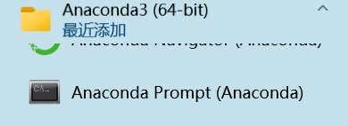
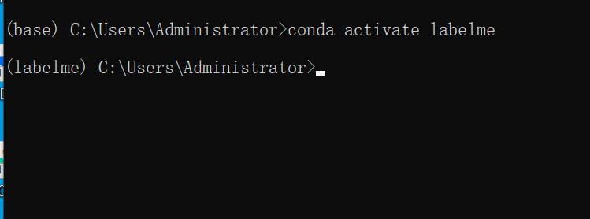
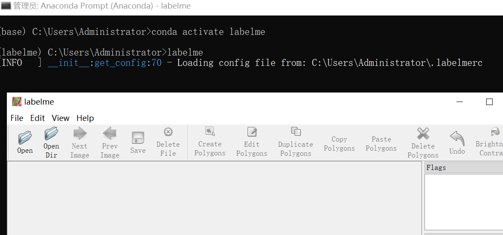
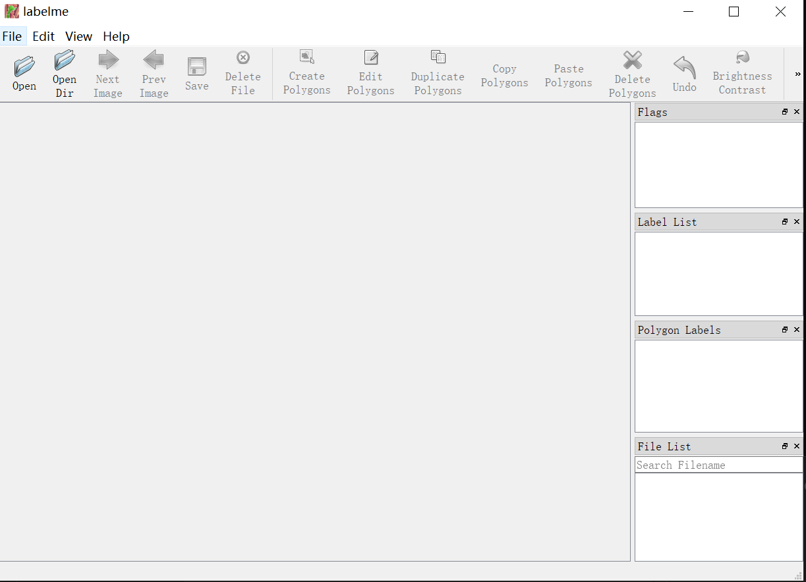
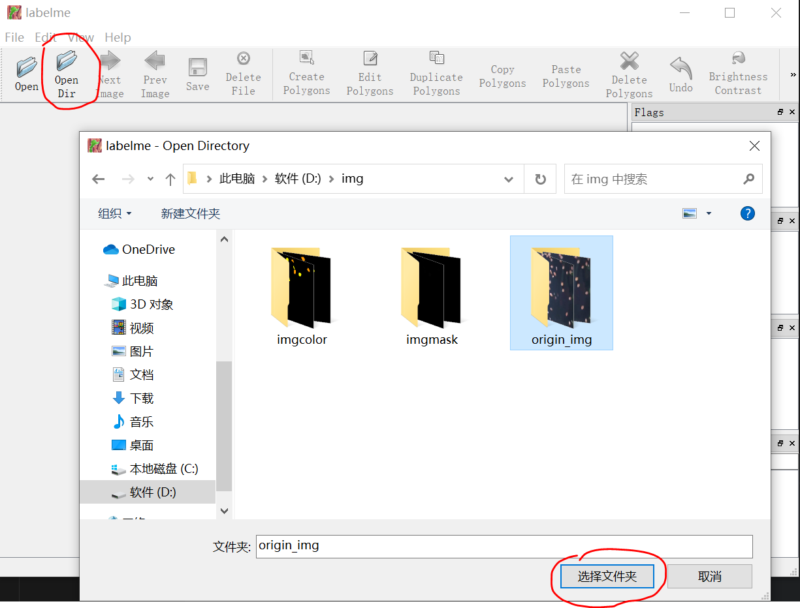
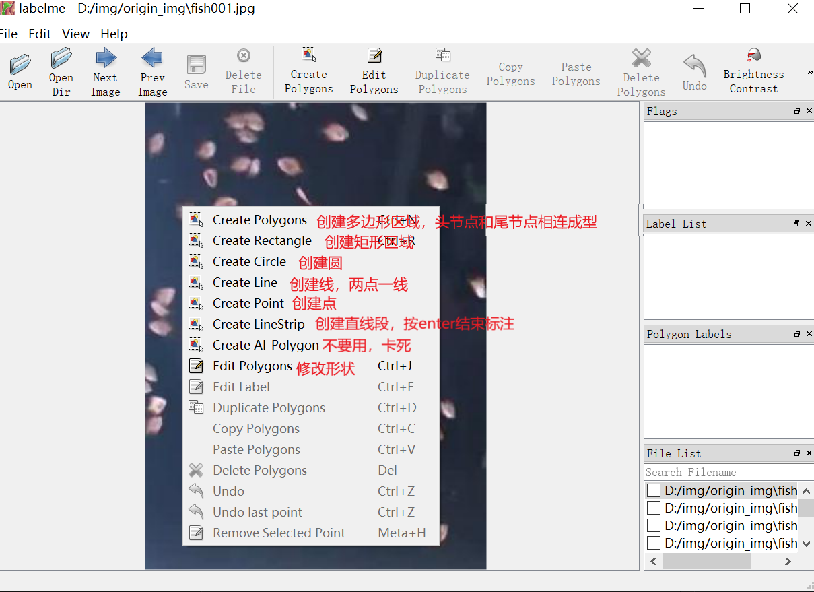
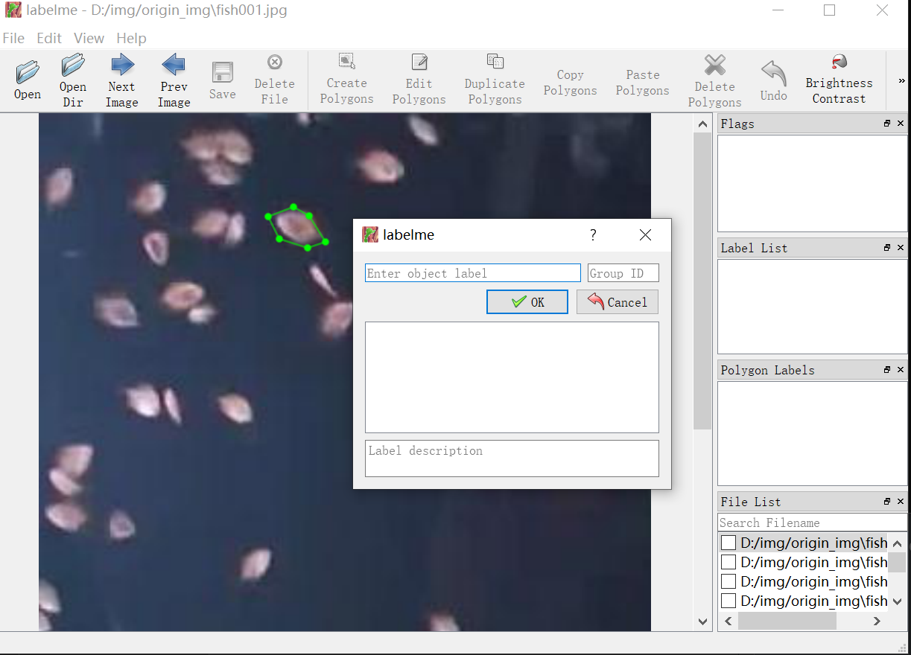
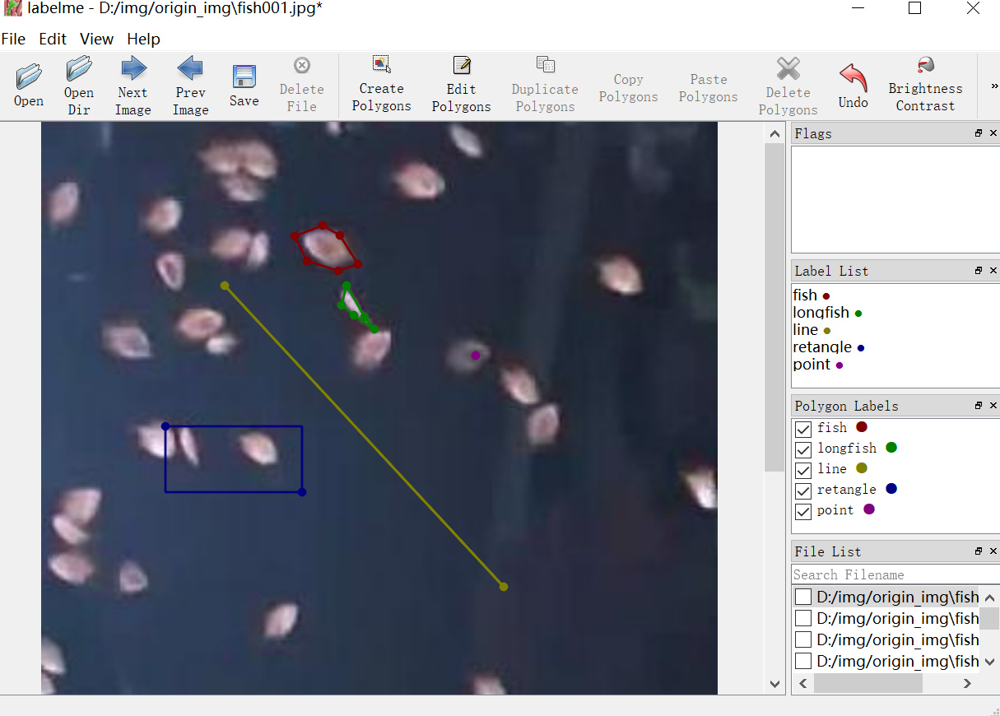
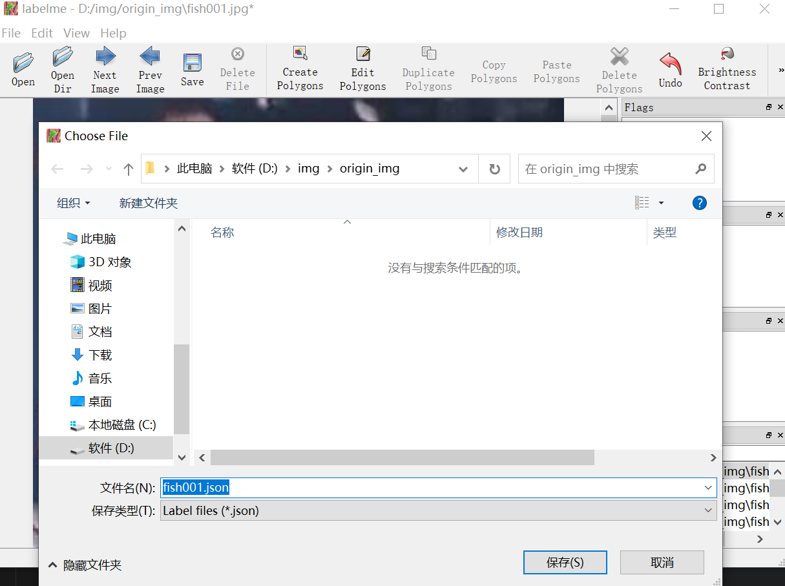
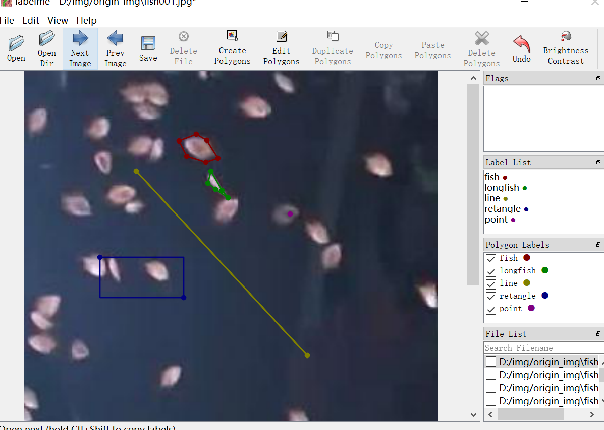

# Labelme 使用手册
## labelme是什么
Labelme是图形图像注释工具，用python编写的，并使用qt运行的一个软件。
其功能可以用于目标检测、图像分割、语义识别等对图像进行标注和分割。
## 安装
### 环境安装
1. anaconda 安装（见anaconda安装教程）
2. 虚拟环境创建 （见anaconda安装教程）
   python==3.8
3. 库安装：
   ```python
   conda install pyqt
   conda isntall pillow
   pip install labelme -i https://pypi.douban.com/simple
   ```
4. 运行labelme
   进入labelme环境
   ```python
   labelme
   ```
## label使用方法
<font size=5>打开菜单栏，选择anaconda文件夹下ananconda prompt


单击打开，英文输入后按enter,每个单词之间有空格，注意是英文字符：
```python
conda activate labelme
```

成功的效果是前面的(base)变成了(labelme)
输入labelme,按enter,进入界面

运行labelme后，首界面

点击Open Dir 打开文件夹，选到文件夹层级

在图片上右键，选择标注方式

选择目标并标注，完成标注后，输入对象标签，英文。选择ok

不同标签会用不同颜色，相同目标选择相同标签

点击Save保存，保存到一个文件及即可，文件夹名称为英文。

点击Next Image进入下一张的标注

</font>
## json文件转化为mask
### 安装包下载

```python
#下载cv2
pip install -i https://pypi.tuna.tsinghua.edu.cn/simple opencv-python
```
### 查看cover.py 和 tocolor.py文件